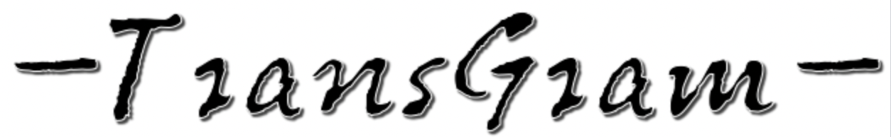

Description
================

TransGram is a genome-guided transcriptome reconstruction tool for long RNA-seq reads.

Prerequisites
================

  g++ with support for C++11 (e.g. 4.7.2)
  
  Please ensure that [xgboost][xgboost] is properly installed !
 

# 1. Installing and test
===========================================================================
    
    (A) Installing xgboost 
    
          $ pip install xgboost
          
    (B) Download the lastest version of TransGram and make.
    
          $ git clone https://github.com/yutingsdu/TransGram 
          $ cd TransGram
          $ make all release
          
    (C) Test TransGram on the demo data set.
        
        Change to TransGram/sample_test/, and type the following command:
        
          $ ./run_me.sh
          
        If you get the transgram_outdir/TransGram.gtf, congrats, you succesfully installed TransGram.
      
        
===========================================================================

# 2. Usage 
===========================================================================

TransGram-v.0.0 usage:

** Required **

    --bam/-b <string>		: Path to the alignment BAM files generated by minimap2.

    --ont/--pacbio			: For Nanopore or PacBio reads
---------------------------------------------------------------------------

** Options **

    --help/-h			: Output TransGram Help Information

    --version/-v			: Print current version of TransGram

    --output_dir/-o       <string>	: Output path for TransGram (default:transgram_outdir)

    --min_trans_length/-l <int>   	: Minimum assembled transcript length (default:200)

    --min_trans_score/-s  <double> 	: Minimum xGboost score for the assembled transcripts (default:0.1)

    --min_average_frac/-c <double>  : Minimum junction coverage fraction by average junction coverage (default:0.001)

    --QA		      <string>	: Path to the transcripts generated from the correspoding BAM file(in GTF format).
				  TransGram will assess the quality and filter them based on a specific parameter(requires -s)

    --CusModel	      <string>  : Path to the customized model created by the users.

---------------------------------------------------------------------------

** Typical commands **

A typical TransGram command for ONT data might be:

    TransGram -b alignment.bam --ont -o transgram_outdir

# 3. Running TransGram with a  customized model
===========================================================================

If you choose to run TransGram with a customized model for filteringt the discovered transcripts, please refer to [training][training].

===========================================================================

Authors: Ting Yu and Zitong Ren designed and wrote TransGram. \n
Contact:
Any questions, problems, bugs are welcome and should be dumped to Ting Yu <yutingsdu@163.com>
Updated on Dec 13, 2024.

[xgboost]: https://github.com/dmlc/xgboost
[training]: https://github.com/yutingsdu/TransGram/tree/main/xgboost_predict/train
 
